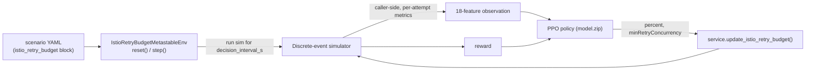
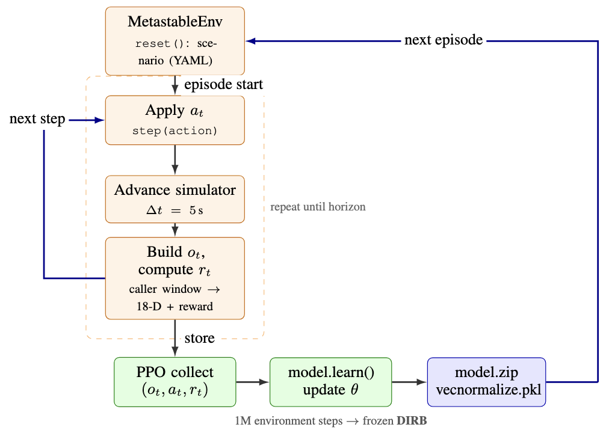

# Reinforcement-learning retry-budget controller

This folder documents the **RL extension** added to the simulator on the
`smart-retry/simulator-rl` branch. It is an *optional* addition: the core
simulator behaves exactly as before, and RL is only active when you run the
scripts under [`../../bin/rl/`](../../bin/rl).

- New to this work? Read this page top to bottom.
- Want a per-model reference (each env, its **reward function**, how to run it)?
  See [`models.md`](models.md).
- Want the exact action/observation contract? See
  [`action_observation_spaces.md`](action_observation_spaces.md).
- Want to run the trained model? See the model card at
  [`../../models/RB-RL.v5/README.md`](../../models/RB-RL.v5/README.md).
- Want to know where each script writes its output? Every folder under
  [`../../bin/rl/`](../../bin/rl) has its own `README.md`, and
  [`../../bin/rl/README.md`](../../bin/rl/README.md) has the output conventions.

## What problem this solves

Aggressive retries can turn a brief fault or load spike into a **metastable
failure**: the original trigger is gone, but retries keep the service overloaded
and goodput stays low. A static retry budget helps but a single fixed setting is
rarely optimal across the whole incident.

The RL controller treats retry governance as an **online control problem**. Every
few seconds it observes recent mesh telemetry and adjusts a server-side
Istio/Envoy retry budget (`retryBudget.percent` and `retryBudget.minRetryConcurrency`).
The goal is faster recovery from metastable amplification without causing retry
storms. The policy is trained entirely in this simulator and is designed so the
same model can drive a real in-cluster Istio controller (the live prototype lives
on the `smart-retry/prototype` branch).

**Final/report model:** in the report this model is named **DIRB**,
for **Dynamic Istio Retry Budget**. In this repository, the committed checkpoint
for DIRB is stored as `models/RB-RL.v5/`. Its model type is
`IstioRetryBudgetMetastableEnv`, and it controls only the server-side Istio
retry-budget fields (`percent`, `minRetryConcurrency`). The token-bucket,
relative-action, and hybrid models are earlier research variants, not the final
reported model.

## How RL plugs into the simulator (and how to turn it off)

The simulator is a discrete-event engine. Normal experiments are **static**: a
scenario YAML fixes every policy for the whole run. RL wraps that same engine in a
Gymnasium environment that pauses every decision interval, builds an observation,
asks the PPO policy for an action, mutates the retry budget, and resumes.



| Mode | How to run | Retry budget behaviour |
|------|-----------|------------------------|
| **RL off (default)** | `python bin/workflow.py <yaml>` | Whatever the YAML sets is held fixed for the whole run. |
| **RL on** | `python bin/rl/eval/...` / `bin/rl/train/...` / `bin/rl/benchmark/...` | PPO changes `percent` / `minRetryConcurrency` every decision interval. |

A scenario "supports" RL when a service declares an `istio_retry_budget:` block,
for example in
[`../../experiments/yaml/rl/istio_retry_budget_metastable.yaml`](../../experiments/yaml/rl/istio_retry_budget_metastable.yaml):

```yaml
services:
  - name: svc-A
    # ...
    istio_retry_budget:
      percent: 20.0
      min_retry_concurrency: 3
```

Running that YAML with `bin/workflow.py` keeps `(20%, 3)` static (this is also the
benchmark's "static budget" baseline). Running it through the RL scripts lets the
agent tune those two fields online.

## Training loop at a glance



Each episode starts from a YAML scenario. At every `step(action)`, the environment
applies the current retry-budget action, advances the simulator by one decision
interval, builds the next observation/reward pair, and hands those samples to PPO.
After enough environment steps, training freezes the learned policy as
`model.zip` plus its matching `vecnormalize_stats.pkl`.

## Install

The RL stack (`stable-baselines3`, `gymnasium`, `torch`, `tensorboard`) is an
**optional extra** — the core simulator does not need it. From the `simulator/`
directory:

```bash
pip install -e .            # core simulator only
pip install -e ".[rl]"      # core + RL dependencies (what you want here)
```

The exact deps and version floors live in the `rl` extra in
[`../../setup.py`](../../setup.py); `requirements-rl.txt` mirrors it for pip-only
workflows. Floors match the stack `RB-RL.v5` was trained with
(stable-baselines3 2.8, gymnasium 1.2, torch 2.x, tensorboard 2.x).

Notes:

- Project convention uses the repo-level `.venv`.
- `torch` wheels can lag the newest Python release; Python 3.10-3.12 is the
  safest range. For a specific CPU/CUDA build, install `torch` via the official
  PyTorch index first, then `pip install -e ".[rl]"`.

## Repository map of the RL work

```text
simulator/
  bin/rl/                       # RL entry points (the only place RL is "activated"); see its README
    _pathsetup.py               # puts src/ + sibling script folders on sys.path
    rl_paths.py                 # shared rule for where eval/benchmark output is written
    matplotlib_safe.py          # headless matplotlib helper shared by RL scripts
    train/                      # training scripts (each folder has a README)
    eval/                       # evaluation scripts (drive sim + plot)
    benchmark/                  # RL vs no-budget / static / best-static suites
    analyze/                    # policy + telemetry signal analysis
  outputs/rl/                   # generated eval/benchmark artifacts (git-ignored)
  src/simulator/rl/             # the RL library (Gymnasium environments)
    istio_retry_budget_env.py   # CURRENT env (Istio percent / minRetryConcurrency)
    random_scenario_env.py      # token-bucket env (earlier work)
    relative_action_env.py      # relative (+/-) action variant
    metastable_relative_action_env.py
    metastable_fairness_env.py  # multi-client fairness scenarios
    hybrid_metastable_env.py    # time + event based hybrid budget
    hybrid_retry_budget.py
    env.py                      # first proof-of-concept env
  src/simulator/policies/istio_retry_budget.py   # the Istio-style budget limiter
  experiments/yaml/rl/          # RL scenario + benchmark configs (see its README)
  models/RB-RL.v5/              # committed trained model for inference/benchmarks
  docs/rl/                      # this documentation
```

## Directory guide: where to look first

| If you want to understand... | Start here | Why |
|------------------------------|------------|-----|
| The big picture and current model | `docs/rl/README.md` | This page explains how RL plugs into the simulator and links outward. |
| What each model is and why it exists | `docs/rl/models.md` | Model families, control knobs, observations, reward functions, and run commands. |
| Exact tensor/action contracts | `docs/rl/action_observation_spaces.md` | Fixed observation order and action grids; important for inference compatibility. |
| How to run commands | `bin/rl/README.md` | Explains `train/`, `eval/`, `benchmark/`, `analyze/`, and output locations. |
| What the benchmark scenarios mean | `experiments/yaml/rl/README.md` | Catalog of YAMLs, fault families, `switchback_adversarial`, and common fields. |
| The committed reference model | `models/RB-RL.v5/README.md` | Model card: files, training recipe, inference command, benchmark results. |
| The implementation internals | `src/simulator/rl/README.md` | Gymnasium environment modules and how they wrap the simulator. |

## The control surface evolved (lineage)

All variants are kept and runnable. The **Istio retry budget is the final report
model type and the current recommended one**; the earlier variants explain how
the design got there.

| Stage | Control knobs | Env class | Scripts (prefix) |
|-------|---------------|-----------|------------------|
| Proof of concept | retry-policy tuning | `env.py` | `train_rl_test`, `train_random_test` |
| Token bucket | `refill_rate`, `bucket_capacity` | `random_scenario_env`, `relative_action_env` | `train_random`, `train_relative`, `run_benchmarks*` |
| Token bucket (metastable / hybrid) | + fairness, hybrid refill | `metastable_*`, `hybrid_*` | `train_metastable_*`, `run_metastable_benchmarks_*` |
| **DIRB: Dynamic Istio Retry Budget (final/report model)** | `percent`, `minRetryConcurrency` | `istio_retry_budget_env` | `train_istio_retry_budget_metastable`, `eval_istio_retry_budget_metastable`, `run_istio_retry_budget_benchmarks`, `analyze_istio_retry_budget_signals` |

## Script catalog

Run everything from the `simulator/` directory. `*` marks the final/report Istio scripts.

### Train (`bin/rl/train/`)

| Script | Purpose |
|--------|---------|
| `train_istio_retry_budget_metastable.py` * | Train the final/report Istio retry-budget controller |
| `train_metastable_absolute.py` / `train_metastable_relative.py` | Token-bucket metastable training (absolute / relative actions) |
| `train_metastable_hybrid_absolute.py` / `train_metastable_hybrid_relative.py` | Hybrid (time + event) budget training |
| `train_random.py` / `train_relative.py` | Token-bucket training on randomized scenarios |
| `train_rl_test.py` / `train_random_test.py` | Fast smoke tests of the training loop |

### Evaluate (`bin/rl/eval/`)

| Script | Purpose |
|--------|---------|
| `eval_istio_retry_budget_metastable.py` * | Evaluate the Istio model vs no-budget and static baselines on a scenario |
| `eval_rl_scenario.py` | Shared evaluation engine (imported by the others) |
| `eval_rl_metastable_absolute.py` / `_relative.py` / `_hybrid.py` | Evaluate token-bucket / hybrid models |
| `eval_rl_scenario_relative.py` | Evaluate relative-action token-bucket models |

### Benchmark (`bin/rl/benchmark/`)

| Script | Purpose |
|--------|---------|
| `run_istio_retry_budget_benchmarks.py` * | Istio benchmark suite (no-budget vs static vs RL) |
| `metastable_benchmark_suite.py` | Resolves the metastable benchmark YAML set |
| `run_metastable_benchmarks_absolute.py` / `_relative.py` / `_hybrid.py` | Metastable benchmark suites per model family |
| `run_benchmarks.py` / `run_benchmarks_relative.py` | Token-bucket fairness benchmark suites |
| `run_static_metastable_failure.py` | Static / best-static baseline search |
| `compare_rl_vs_baseline.py` | Quick single-scenario RL vs baseline comparison |

### Analyze (`bin/rl/analyze/`)

| Script | Purpose |
|--------|---------|
| `analyze_istio_retry_budget_signals.py` * | Which telemetry signals the policy relies on (learned + inference importance) |
| `analyze_policy_first_layer.py` | First-layer weight importance per input feature |
| `analyze_rollout_correlation.py` | Correlation / mutual information between signals and actions |
| `plot_istio_focused_benchmark.py` / `plot_top_signal_action_correlations.py` | Plot helpers for benchmark / signal outputs |

## Quickstart (final/report Istio model)

```bash
# 1. Inference: evaluate the shipped model on the training scenario
python bin/rl/eval/eval_istio_retry_budget_metastable.py \
  --model models/RB-RL.v5/model \
  --yaml experiments/yaml/rl/istio_retry_budget_metastable.yaml \
  --decision-interval-s 5 --observation-window-s 10 --delta-window-s 5

# 2. Benchmark the shipped model vs no-budget and static budget
python bin/rl/benchmark/run_istio_retry_budget_benchmarks.py \
  --model models/RB-RL.v5/model \
  --decision-interval-s 5 --observation-window-s 10 --delta-window-s 5

# 3. Train your own (timestamped run under trained_models/, git-ignored)
python bin/rl/train/train_istio_retry_budget_metastable.py \
  --timesteps 1000000 \
  --decision-interval-s 5 --observation-window-s 10 --delta-window-s 5

# 4. Analyze which signals the policy uses
python bin/rl/analyze/analyze_istio_retry_budget_signals.py \
  --model models/RB-RL.v5/model

# 5. RL off: plain static simulation of the same scenario
python bin/workflow.py experiments/yaml/rl/istio_retry_budget_metastable.yaml
```

## Inference contract (read before deploying or scripting)

1. Load `model.zip` with `PPO.load` and **always** load the matching
   `vecnormalize_stats.pkl` from the same run. The eval scripts do this for you
   when you pass `--model <dir>/model` (no `.zip`); the stats are read from the
   directory next to the model.
2. Use the **same** `decision_interval_s`, `observation_window_s`, and
   `delta_window_s` the model was trained with. For `RB-RL.v5` that is `5 / 10 / 5`.
3. The observation is 18 caller-side, per-attempt features in a fixed order, and
   the action is `MultiDiscrete([6, 6])`. The action grid and observation
   semantics are part of the contract — old checkpoints/normalization stats are
   not compatible across action-space or feature changes. Full reference:
   [`action_observation_spaces.md`](action_observation_spaces.md).

## Models

| Model | Status | Notes |
|-------|--------|-------|
| `RB-RL.v5` | DIRB / final report model / shipped | Committed under `models/RB-RL.v5/`. In the report this model is called **DIRB** (**Dynamic Istio Retry Budget**). Trained at `5 / 10 / 5`, profile `metastable_fairness`, using `IstioRetryBudgetMetastableEnv`. See its [model card](../../models/RB-RL.v5/README.md). |

Local training runs land under `trained_models/` (git-ignored). Promote a new
model by copying its `model.zip` + `vecnormalize_stats.pkl` into `models/`.

## Results / benchmarking

Headline benchmark numbers and the signal-importance analysis for the shipped
model are committed under
[`../../models/RB-RL.v5/results/`](../../models/RB-RL.v5/results). The main finding:
all policies see similar retry amplification *during* a fault, but the learned
controller recovers fastest *after* the fault clears, because it can time when to
reopen the budget instead of holding one compromise setting. The benchmark scripts
regenerate these CSVs and plots for any model.
