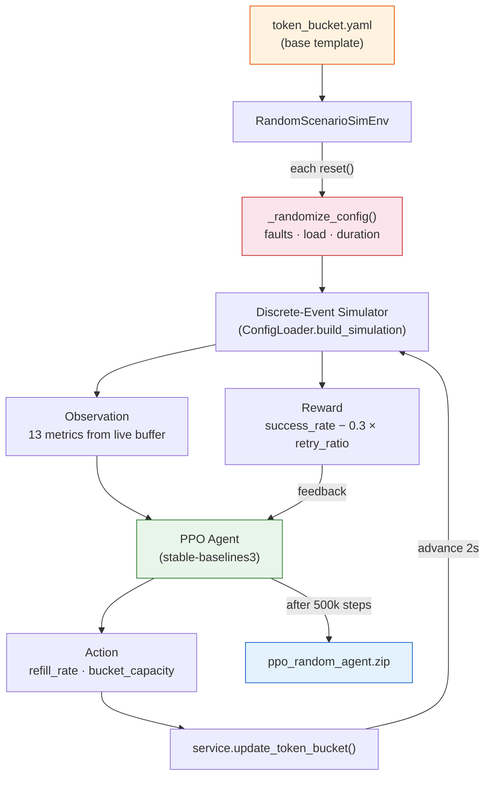
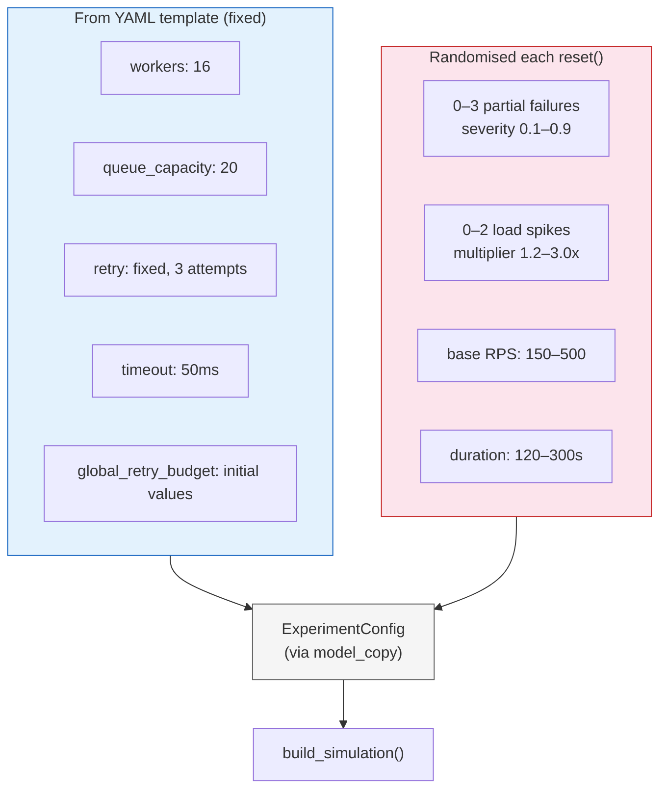

# RL Token Bucket Agent

RL agent dynamically tunes a **server-side global retry budget** (token bucket) to prevent retry storms and metastable failures.

## Training Pipeline

## Scenario Randomisation (per episode)

